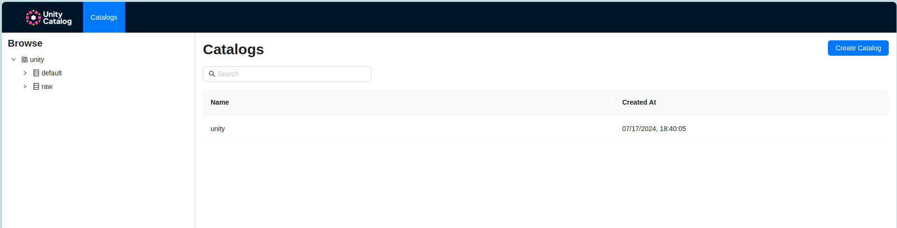
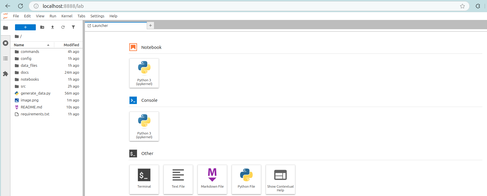

<h1 align="center"># Unity Catalog Demo with Apache Spark</h1>
<p align="center"><b>This repository is a playground for those are curious about setting up Unity Catalog OSS version integrated with Apache Spark.</b></p>
<hr />

🚀 Exploring Unity Catalog Open Source

**Databricks' Unity Catalog** is now open source, bringing a unified and open governance layer for data and AI across clouds, formats, and engines. Built on an OpenAPI spec with an Apache 2.0 license, it extends support for Delta Lake, Apache Iceberg, Parquet, CSV, and more—making it a game-changer for multi-format and multi-engine environments.


This repository showcases a practical Unity Catalog implementation, demonstrating its capabilities in action. Let's dive in! 🔥

# 🔍 Prerequisites

- **Apache Spark**: Download the latest version of Apache Spark >= 3.5.3
- **Java**: To run Unity Catalog, you need JAVA 17 installed on your machine. ([Documentation](https://docs.unitycatalog.io/quickstart/#quickstart))
- **Unity Catalog GitHub repository**: You need to clone this [repository](https://github.com/unitycatalog/unitycatalog) to start the UC server and UI ([Documentation](https://docs.unitycatalog.io/quickstart/#how-to-start-the-unity-catalog-server))
- **Virtual Environment**: Any environment manager you're most familiar. For this demo, I use [miniconda3](https://docs.anaconda.com/miniconda/install/) as an environment manager to create isolated environment.
Prerequisites
- **Node**: https://nodejs.org/en/download/package-manager
- **Yarn**: https://classic.yarnpkg.com/lang/en/docs/install

> Note: Depending on your preferred setup method, you might need to set `SPARK_HOME` and `JAVA_HOME` in the environment variables.

## ✅ Verify your installation
To ensure set up has been done properly, you can verify the installation with following commands:

**Apache spark**: 
---
```bash
$SPARK_HOME/bin/pyspark --version
----
Welcome to
      ____              __
     / __/__  ___ _____/ /__
    _\ \/ _ \/ _ `/ __/  '_/
   /___/ .__/\_,_/_/ /_/\_\   version 3.5.3
      /_/
                        
Using Scala version 2.12.18, OpenJDK 64-Bit Server VM, 17.0.14
Branch HEAD
Compiled by user haejoon.lee on 2024-09-09T05:20:05Z
Revision 32232e9ed33bb16b93ad58cfde8b82e0f07c0970
Url https://github.com/apache/spark
Type --help for more information.
```

**Java**:
---
```bash
java -version
----
(base) khoa-le@khoa-le-MS-7B19:~$ java -version
openjdk version "17.0.14" 2025-01-21
OpenJDK Runtime Environment (build 17.0.14+7-Ubuntu-124.04)
OpenJDK 64-Bit Server VM (build 17.0.14+7-Ubuntu-124.04, mixed mode, sharing)
```
## 🚀 Quick Start
### Setting up environment variables
First, copy the file `.env.sample` from root repository and rename it as `.env`. Update the content of the file:
| Variable         | Description                      | Example                                     |
|------------------|----------------------------------|-------------------------------------------|
| `CATALOG`        | Name of your catalog             | unity |
| `RAW_SCHEMA`     | Name of your raw schema          | raw |
| `CURATED_SCHEMA` | Name of your curated schema      | curated |
| `PROJECT_FOLDER` | Absolute path of your project folder      | /working/demo-uc
| `STORAGE_FOLDER` | Absoluate path where you want to store data of external tables  | /working/temp_storage |
| `UC_HOME`        | Absolute path where you cloned the unity catalog repository    | /working/uc/unitycatalog` |

### Install pip dependencies
> [!IMPORTANT]  
> **From this step, we assume that you already created a virtual environment and only install dependencies within that environment as best practices**
<hr />

From root directory, run:
```
pip install -r requirements.txt
```
### Start UC server
To start uc server:
```bash
./commands/start-uc-server.sh
```

Create another terminal and run below command to enable UC UI:
```bash
./commands/start-uc-ui.sh
```

To verify, if both server and UI have been launched, navigating to: `http://localhost:3000/` or `http://127.0.0.1:3000/`


### Playground
To open a jupyter notebook with Spark configured, run:
```bash
./commands/start-notebook.sh
```

This will automatically open up a new tab pointing to `http://localhost:8888/lab`



You're free to test UC code yourself by open each notebook in `notebooks` folder.

# References:
For a full instructions and official documentation, please visit Unity Catalog OSS documentation:
- Quick start: https://docs.unitycatalog.io/quickstart/
- Apache Spark Integratation: https://docs.unitycatalog.io/integrations/unity-catalog-spark/
- Unity Catalog CLI Usage: https://docs.unitycatalog.io/usage/cli/
- Unity Catalog UI Usage: https://docs.unitycatalog.io/usage/ui/
- Unity Catalog Server Configuration: https://docs.unitycatalog.io/server/configuration/
